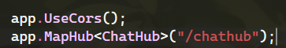
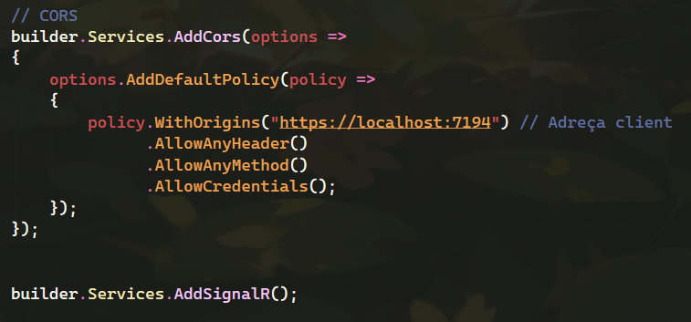
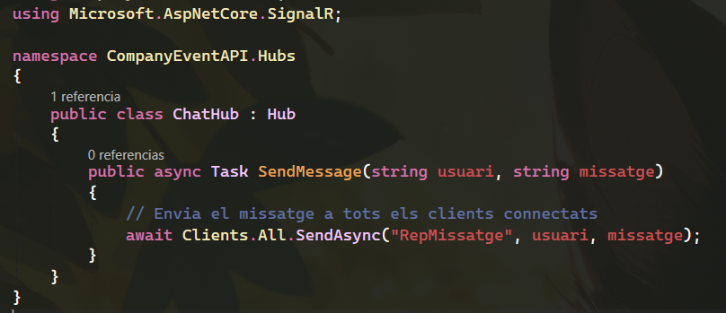
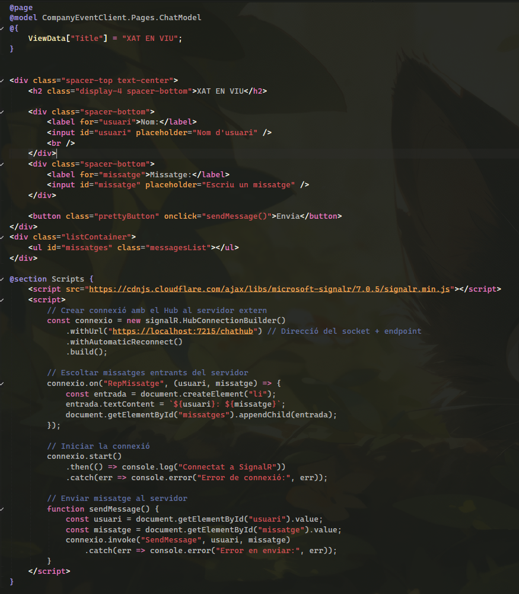

# M09.T1.Serveis: 2ºConvocatòria - Recull d'activitats

## Exercici 1

**a. TLS/HTTPS**
TLS fa servir:

* **Criptografia asimètrica**: en l'intercanvi inicial de claus i l'autenticació del servidor (certificat).
* **Criptografia simètrica**: per xifrar la comunicació un cop establerta la connexió segura (ex: AES).
* **Hashing**: per garantir la integritat de les dades amb HMAC.

**b. WPA2**
WPA2 utilitza:

* **Simètrica (AES)** per xifrar dades entre dispositius i el punt d'accés.
* **Hashing** en el 4-Way Handshake per autenticar les claus sense transmetre-les directament.

**c. Bitlocker/FileVault**
Totes dues:

* Utilitzen **criptografia simètrica** (AES) per xifrar discs.
* En alguns casos, gestionen les claus simètriques amb claus asimètriques (TPM o smartcards).

**d. Blockchain (Bitcoin / Ethereum)**

* **Criptografia asimètrica** per a signatura digital de transaccions.
* **Hashing (SHA-256)** per enllaçar blocs, crear adreces i validar la integritat de la cadena.

---

## Exercici 2

**a. Comunicació HTTP**

* La comunicació és sense estat i segueix el patró petició-resposta.
* Composició:

  * Petició: mètode HTTP, URI, capçaleres, cos (opcional).
  * Resposta: codi d'estat, capçaleres, cos amb contingut.

**b. Verbs més comuns**

* **GET**: obtenir un recurs.
* **POST**: crear un recurs.
* **PUT**: reemplaçar un recurs.
* **PATCH**: modificar parcialment un recurs.
* **DELETE**: eliminar un recurs.

**c. Codi i body per casos concrets**

* **i. GET amb id trobat**: `200 OK` i JSON amb les dades del recurs.
* **ii. DELETE amb error BBDD**: `500 Internal Server Error` amb missatge: `{ "error": "No s'ha pogut eliminar el recurs." }`
* **iii. PATCH amb recurs inexistent**: `404 Not Found` amb `{ "error": "Recurs no trobat." }`
* **iv. Login amb dades incorrectes**: `401 Unauthorized` amb `{ "error": "Credencials invàlides." }`
* **v. POST amb rol no permès**: `403 Forbidden` amb `{ "error": "No tens permisos per fer aquesta acció." }`

---

## Exercici 3

| Característica           | WebSocket                          | Socket TCP convencional             |
| ------------------------ | ---------------------------------- | ----------------------------------- |
| Protocol base            | HTTP per l'establiment, després WS | TCP/IP                              |
| Bi-direccionalitat       | Sí, nativa                         | Sí, però sense framing d'alt nivell |
| Persistència de connexió | Sí                                 | Sí                                  |
| Orientat a missatges     | Sí                                 | No, orientat a flux de bytes        |
| Suport al navegador      | Sí                                 | No directe                          |
| Securització             | WSS (WebSocket + TLS)              | SSL/TLS (ex: OpenSSL)               |

**Protocols/seguretat:**

* WebSocket: WSS, autenticació amb token JWT o cookies, CORS.
* TCP: TLS/SSL, validació IP, autenticació a nivell d'aplicació.

---

## Exercici 4

### a. Control d'accés (Rols i privilegis)

* **Alumne**: veure apunts, fer comentaris, veure notes seves, entregar treballs.
* **Professor**: penjar apunts, notes, fer comentaris, censurar comentaris.
* **Cap d'estudis**: crear cursos, assignar alumnes/professors, veure notes i anuncis.
* **Secretaria**: alta/baixa alumnes.
* **Desenvolupador seguretat**: accés total a funcionalitats, no pot veure dades sensibles.

### b. Gestió de contrasenyes

* Longitud mínima de 12 caràcters.
* Incloure majúscules, minúscules, números i caràcters especials.
* Caducitat cada 90 dies per rols de gestió.
* 2FA per a caps d'estudis, desenvolupadors i secretaria.

### c. Protecció de la informació

* **Alta sensibilitat**: Compte corrent, telèfons d'emergència, notes -> encriptat + accés restringit.
* **Mitjana sensibilitat**: Dades personals -> control d'accés per rol, no exposades externament.
* **Baixa sensibilitat**: Nom, nacionalitat, rol -> accés general dins del sistema.

### d. Còpies de seguretat

* **Estratègia 3-2-1**: 3 còpies, 2 suports diferents, 1 fora de lloc.
* **Còpies incrementals**: diàries.
* **Snapshots** abans de cada actualització.
* **Tests regulars** de restauració.

---

## Exercici 7: Documentació del Xat amb SignalR

### 📸 Captura 1 - `ChatHub.cs`



📌 Explicació:

- **ChatHub** és el cor de la comunicació. Permet als clients enviar i rebre missatges.
- **SendMessage()** és la funció que reben tots els clients connectats.
- El format del missatge compleix el requisit: `[Data/hora] > [Nom Usuari]: [Missatge]`.


### 📸 Captura 2 - `Program.cs` (Configuració de serveis)



📌 Explicació:

- La política **CorsPolicy** permet connexions des del client (React, etc.) ubicat en **localhost:3000**.
- És necessari per evitar errors de connexió entre el client i servidor.
- El **MapHub<ChatHub>** estableix el punt d'entrada de la connexió WebSocket per SignalR a **/chatHub**.


### 📸 Captura 3 - `Chat.js` (client web)



📌 Explicació:

- Es crea la connexió amb el servidor a través de **/chatHub**.
- **ReceiveMessage** és l’event que el servidor emet, i el client mostra a la interfície.


### 📸 Captura 4 - Enviament del missatge des del client



📌 Explicació:

- Quan es fa clic a “Enviar”, s’obté l’usuari i missatge, i s’invoca **SendMessage()** del **ChatHub**.
- Si la connexió falla, mostra error de connexió com es demana a l’enunciat.


---

## Exercici 8 (Errors en codi i correcció)

**Codi donat:**

```csharp
[HttpDelete("login")]
public async Task<IActionResult> Login([FromBody] UserLoginDTO user)
{
    var usuari = await _userManager.FindByEmailAsync(user.Email);
    if (usuari.Email != user.Email)
        return Ok("Error");

    var claims = new List<Claim>()
    {
        new Claim(ClaimTypes.Name, usuari.UserName),
        new Claim(ClaimTypes.NameIdentifier, usuari.Id.ToString())
    };

    _logger.Information("Usuari {usuari.UserName} amb id  {usuari.Id.ToString()} i password {usuari.password} ha fet logging amb èxit!");

    var token = CreateToken(claims.ToArray());
    return Ok(usuari);
}
```

**Errors:**

* Mètode HTTP incorrecte (DELETE per login).
* Comparació innecessària d'email.
* Log amb dades sensibles (contrassenya).
* Retorna objecte sencer usuari (pot incloure info privada).

**Correcció:**

```csharp
[HttpPost("login")]
public async Task<IActionResult> Login([FromBody] UserLoginDTO user)
{
    var usuari = await _userManager.FindByEmailAsync(user.Email);
    if (usuari == null || !await _userManager.CheckPasswordAsync(usuari, user.Password))
        return Unauthorized("Invalid credentials.");

    var claims = new[]
    {
        new Claim(ClaimTypes.Name, usuari.UserName),
        new Claim(ClaimTypes.NameIdentifier, usuari.Id.ToString()),
        new Claim(ClaimTypes.Role, "Client")
    };

    var token = CreateToken(claims);
    _logger.Information("Login correcte per {UserName}", usuari.UserName);

    return Ok(new { Token = token });
}
```

**Principis vulnerats en el codi original:**

* Principi de minimització de dades exposades.
* No registrar dades sensibles.
* Ús correcte de mètodes HTTP segons la semàntica REST.

---

### Creat per

- **Miquel Manzano** - [@miquel-manzano](https://github.com/miquel-manzano)

```
⠀⠀⠀⠀⠀⠀⠀⠀⠀⠀⠀⠀⠀⠀⠀⠀⠀⠀⠀⠀⠀⢀⡀⠀⠀⠀⠀
⠀⠀⠀⠀⢀⡴⣆⠀⠀⠀⠀⠀⣠⡀⠀⠀⠀⠀⠀⠀⣼⣿⡗⠀⠀⠀⠀
⠀⠀⠀⣠⠟⠀⠘⠷⠶⠶⠶⠾⠉⢳⡄⠀⠀⠀⠀⠀⣧⣿⠀⠀⠀⠀⠀
⠀⠀⣰⠃⠀⠀⠀⠀⠀⠀⠀⠀⠀⠀⢻⣤⣤⣤⣤⣤⣿⢿⣄⠀⠀⠀⠀
⠀⠀⡇⠀⠀⠀⠀⠀⠀⠀⠀⠀⠀⠀⠀⣧⠀⠀⠀⠀⠀⠀⠙⣷⡴⠶⣦
⠀⠀⢱⡀⠀⠉⠉⠀⠀⠀⠀⠛⠃⠀⢠⡟⠀⠀⠀⢀⣀⣠⣤⠿⠞⠛⠋
⣠⠾⠋⠙⣶⣤⣤⣤⣤⣤⣀⣠⣤⣾⣿⠴⠶⠚⠋⠉⠁⠀⠀⠀⠀⠀⠀
⠛⠒⠛⠉⠉⠀⠀⠀⣴⠟⢃⡴⠛⠋⠀⠀⠀⠀⠀⠀⠀⠀⠀⠀⠀⠀⠀
⠀⠀⠀⠀⠀⠀⠀⠀⠛⠛⠋⠁⠀⠀⠀⠀⠀⠀⠀⠀⠀⠀⠀⠀⠀⠀⠀
```

---